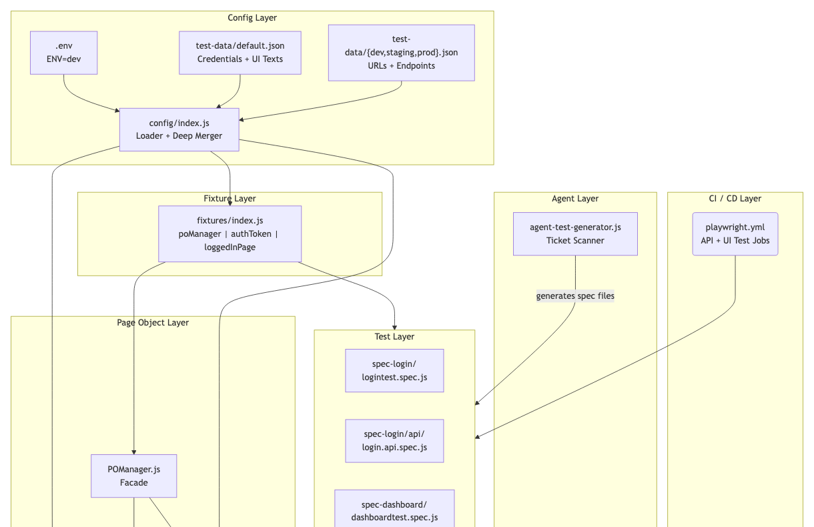
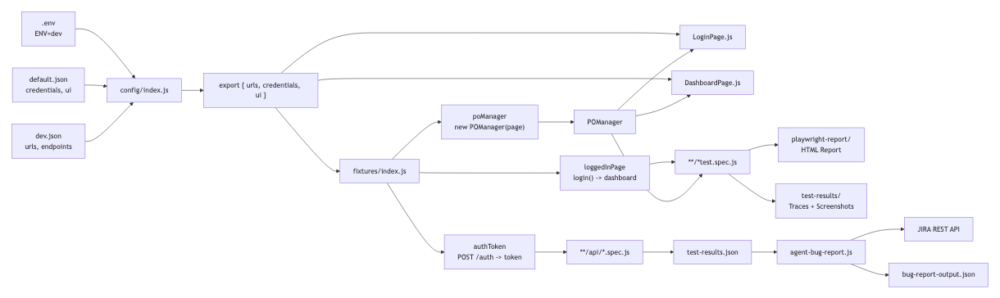
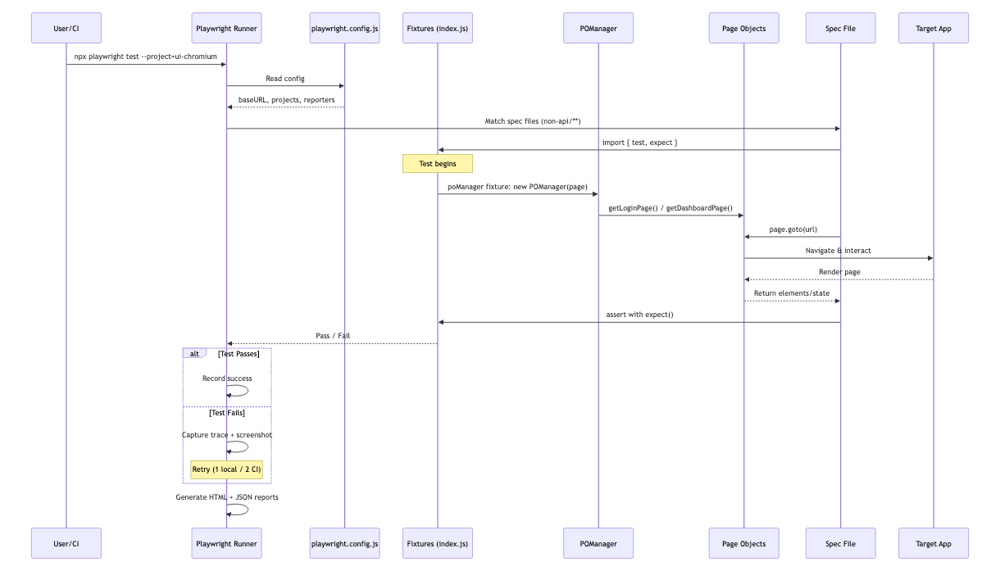
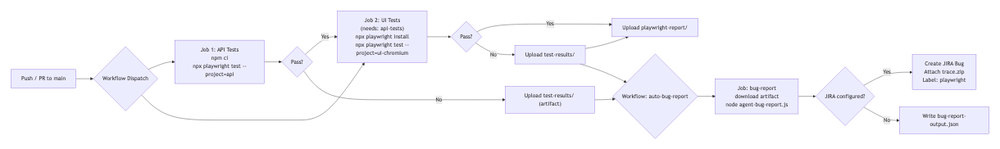
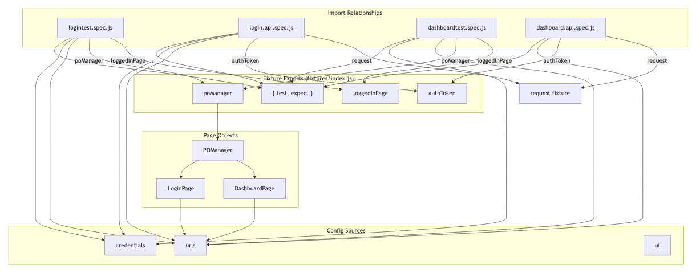
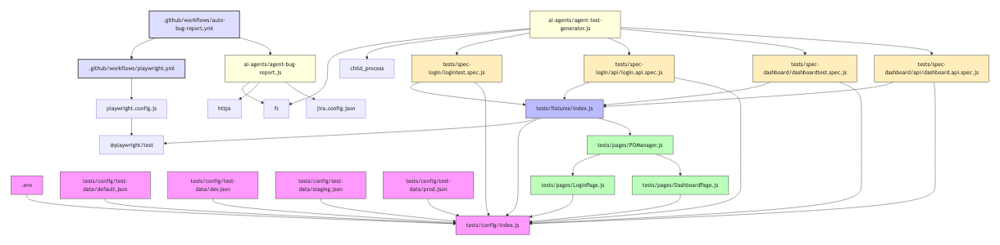

# PlaywrightCLIDemo — Orchestration Diagram

## 1. System Architecture Overview

**Layers (top to bottom):**
- **CI/CD Layer** — GitHub Actions workflows for test execution + auto bug filing
- **Agent Layer** — AI agents for failure analysis (JIRA) and test generation
- **Test Layer** — UI and API spec files for Login and Dashboard modules
- **Fixture Layer** — Custom Playwright fixtures (poManager, authToken, loggedInPage)
- **Page Object Layer** — POManager facade + LoginPage / DashboardPage
- **Config Layer** — Environment loader, test data JSON files, .env

---

## 2. Data Flow Diagram

**Flow:** `.env` + `{env}.json` → config loader → fixtures → page objects → spec files → test results → JIRA bugs

---

## 3. Test Execution Flow

**Sequence:** User triggers Playwright → reads config → matches spec files → fixtures instantiate POManager → page objects interact with target app → assertions → pass/fail with trace on retry

---

## 4. CI/CD Pipeline

**Pipeline:** Push/PR → sequential API + UI test jobs → on failure, upload artifacts → auto-bug-report workflow files JIRA tickets with trace.zip attachments

---

## 5. Component Interaction Matrix

**Matrix:** Which spec files import which fixtures, page objects, and config sources. Login & Dashboard UI specs use `poManager` + `loggedInPage`; API specs use `authToken` + `request` fixture.

---

## 6. File Dependency Graph

**Graph:** Complete `require()` dependency tree across all 20+ project modules — config, fixtures, page objects, specs, agents, and CI workflow files.
